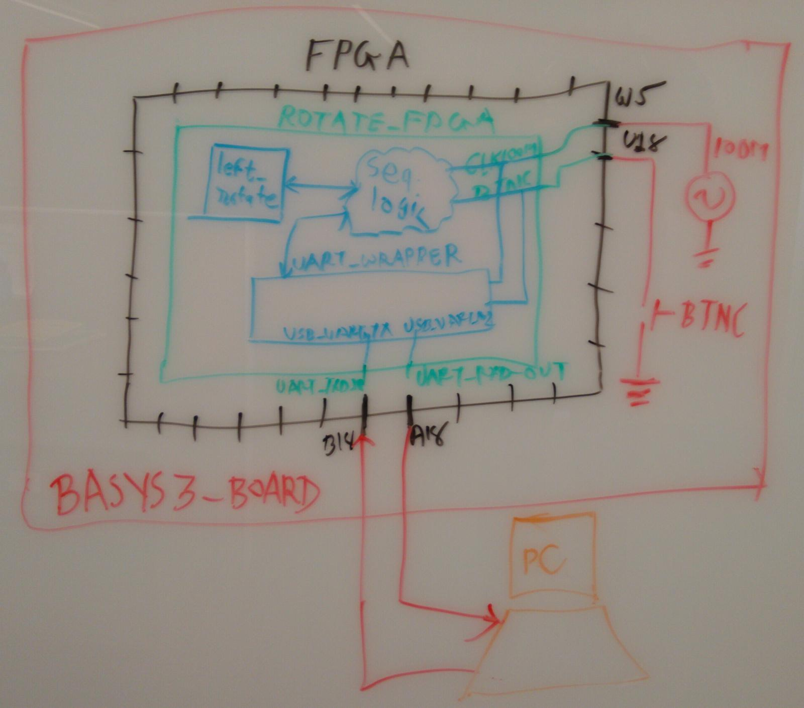

# Description

This Vivado Project provides a UART connection to enter 2 32-bit inputs and measure 1 32-bit output. The Vivado version is 2017.3. It should work on any version above that. If not, create a new project and copy every file in the new project.

The left roate and right rotate function can be instantiated in file rotate_fpga.v to integrate with system.
Right now, the roate_FPGA module is declared for basys3 board with its constraints.
For nexsys4, change the ports of rotate_fpga.v and activate nexsys4.xdc file which is part fo the project.

The Simulation file tb_aes_top.v provides, testbench for this.

## Block Diagram

------ Board file for Digilent Boards-----

https://github.com/Digilent/vivado-boards
https://reference.digilentinc.com/vivado/installing-vivado/start

------------------------------------------

------INSTRUCTION VIDEO FOR PROJECT-------

https://youtu.be/ZZnvHn8ZayU

------------------------------------------

For UART connection, I use moserial software in linux. It is easy to transmit and receive hex vlaues in this software. One can use any softwar to transmit hex values.
UART configuration for software:
* Baud Rate --> 115200
* Data bits --> 8
* Stop bits --> 1
* Parity    --> none

**Hint**: check the input without any rotate and receive the same data.
**Example**: In the software transmit , "0123456789ab0000" in hex, you should receive --> "01234567".

